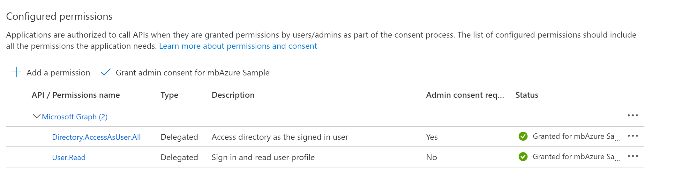
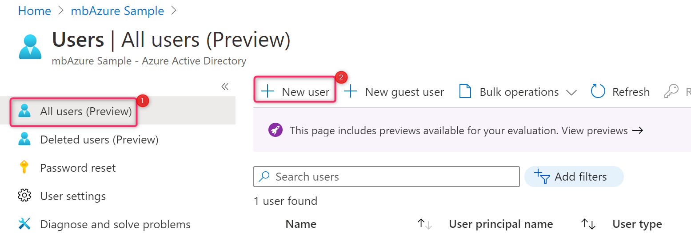
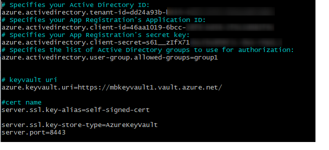

Login to Virtual Machine

1.  Clone sample repo from Github:

git clone
<https://github.com/milindvb/spring-boot-sample-azure-active-directory-keyvault-ssl.git>

Note: This sample assumes that you have a Working Azure Subscription and
Tenant.

2.  Login to Azure portal and Select Azure Active directory

3.  Copy the **Tenant ID**; you will use that value to configure
    your *application.properties* file later in this tutorial.

> 

4.  From the portal menu, select **App registrations**, and then
    select **New Registration**

5.  Specify your application, and then select **Register**.

6.  When the page for your app registration appears, copy
    your **Application ID** and the **Tenant ID**; you will use these
    values to configure your *application.properties* file later in this
    tutorial.

7.  Click **Certificates & secrets** in the left navigation pane. Then
    select **New client secret**.

> 

8.  Add a **Description** and select duration in the **Expires** list.
    Click **Add**. The value for the key will be automatically filled
    in.

> 

9.  Copy and save the value of the client secret to configure
    your *application.properties* file later in this tutorial. (You will
    not be able to retrieve this value later.)

> 

10. Click **API permissions** Click **Microsoft Graph**, then select
    **Directory.AccessAsUser.All** and click **Update Permissions**

11. Click **Grant admin consent for Azure Sample** and select **Yes**.

Permissions will be updated as shown below.

12. From the main page for your app registration,
    select **Authentication**, and select **Add a platform**. Then
    select **Web applications**.

13. Enter *https://\<VirtualMachineIP\>:8443/login/oauth2/code/azure* as
    a new **Redirect URI**, and then select **Configure**.

14. Add a user account to your directory, and add that account to a
    group. From the **Overview** page of your Active Directory, select
    **Users**, and then select **New user**.

15. When the **User** panel is displayed, enter the **User
    name** and **Name**. Then select **Create**.

> 

** **

16. From the **Overview** page of your Active Directory,
    select **Groups**, then **New group** that you will use for
    authorization in your application.

17. Select **No members selected**. (For the purposes of this tutorial,
    we\'ll create a group named *group1*.) Search for the user created
    in the previous step. Select **Select** to add the user to the
    group. Then select **Create** to create the new group.

18. Go back to the **Users** panel, select your test user, and
    select **Reset password**, and copy the username and password; you
    will use this when you log into your application later in this
    tutorial.

## **Create Keyvault and self signed Certificate**

1.  In Azure Portal, click in **Keyvaults** and then click
    **Generate/Import**

2.  Add **Certificate Name**, **Subject** and click on **Create**

3.  Enable Managed System Identity for VM

4.  Open port 8443 in Network Security Group by selecting **Networking**
    and clicking on **Add inbound Port**

5.  Add Access Policy for Cert

6.  In the **Add access policy** section under **Configure from template
    (optional)** choose **Secret Management** from the pull-down menu.

7.  Choose **Select Principal**, and in the search field enter the name
    of the VM you created earlier.  Select the VM in the result list and
    choose **Select**. Select **Add** and Select **Save**

## 

## **Configure and compile your app**

1.  Navigate to the *src/main/resources* folder in your project, then
    open the *application.properties* file in a text editor.

azure.activedirectory.tenant-id	Contains your Active Directory's Directory ID from earlier.

azure.activedirectory.client-id	Contains the Application ID from your app registration that you completed earlier.

azure.activedirectory.client-secret	Contains the Value from your app registration key that you completed earlier.

azure.activedirectory.user-group.allowed-groups	Contains a list of Active Directory groups to use for authorization.

2.  Save and close the *application.properties* file.

3.  Open a command prompt and change directory to the folder where your
    app\'s *pom.xml* file is located.

4.  Build your Spring Boot application with Maven and run it; for
    example:

> mvn clean package -DskipTests
>
> mvn spring-boot:run

5.  Open a browser and Navigate to <https://13.68.147.183:8443/group1>

6.  Login with the user and password created earlier

7.  You will be asked to change the password when you login the first
    time

8.  After login following page will be displayed

9.  The Page will show "Not Secure" because we are using a self-signed
    certificate for this example.

10. Click on "**Not Secure**" and select **Certificate**

11. You will see that the page is signed with the same cert we created
    in Keyvault

